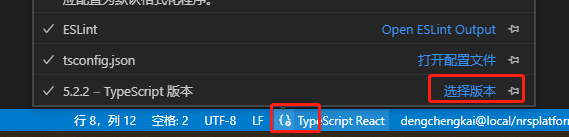

## React

node： 16.18.0

本地 node 版本不是这个，nvm 切换下 node 版本

```c
npm init vite

Need to install the following packages:
  create-vite@4.4.1
Ok to proceed? (y) y
√ Project name: ... portal-site-react
√ Select a framework: » React
√ Select a variant: » TypeScript


npm install react-redux@7.2.8 react-router-dom@6.3.0 redux@4.1.2
```

创建好的项目遇到几个报错

- “--moduleResolution”选项的参数必须为 'node', 'classic', 'node16', 'nodenext'。
  tsconfig.json 中 moduleResolution 改为 node 即可

```json
"compilerOptions": {
     "moduleResolution": "Node",
}
```

- main.tsx 文件中引入 `import React from 'react'`
  报错 index.d.ts(32, 1): 此模块是使用 "export =" 声明的，只能在使用 "allowSyntheticDefaultImports" 标志时进行默认导入。

```json
"compilerOptions": {
     "allowSyntheticDefaultImports": true,
}
```

- main.tsx 文件中引入 App.tsx 报错，提示导入路径不能以“.tsx”扩展名结束。考虑改为导入“./App.js”

原因是因为全局 ts 版本太低，切换到工作区的 ts 版本就没问题了，选择高版本就行

