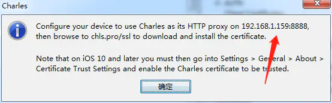
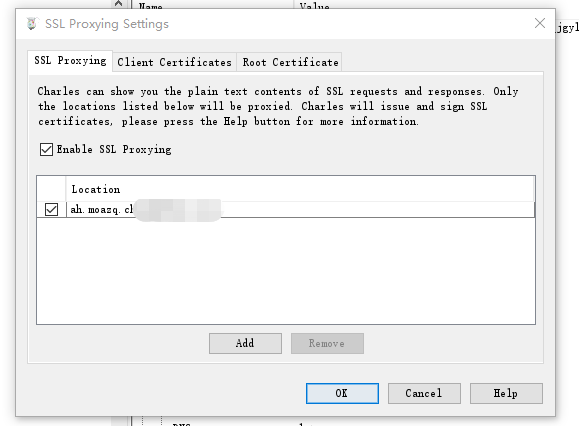

##Charles官网
> https://www.charlesproxy.com/

### 参考网站
> [charles证书安装](https://www.jianshu.com/p/8346143aba53)
> [手把手教你Charles抓包工具使用](https://blog.csdn.net/u012486840/article/details/106593213)
> [charles提示“SSL Proxying not enabled for this host: enable in Proxy Settings, SSL locations”](https://blog.csdn.net/jiang_mingyi/article/details/78845956)

### app抓包

1. 配置charles
- 1.1 打开charles
- 1.2 给电脑安装证书。点击顶部菜单栏【Help】–>选择【SSL Proxying】，点击【install Charles Root Certificate 】安装Charles根证书即可;注意根据提示安装到"受信任的根证书颁发机构"存储区
- 1.3 给手机安装ssl证书。点击顶部菜单栏【Help】–>选择【SSL Proxying】，点击【install charles Root ....Browser 】
    

此步需要给手机设置代理。
- 首先确保电脑跟手机在同一个局域网下，在电脑上ping一下手机wifi的ip地址，能ping通即可
- 修改手机wifi网络中的代理，改为手动，ip填写电脑ip，端口默认8888(charles默认监听8888端口)
- 修改后保存，电脑charles会弹出一个窗口，点击allow就行
- 手机浏览器打开 chls.pro/ssl 网址，下载证书文件，然后系统设置中手动安装凭证即可

    1.4 设置SSL Proxying setting
    需要将抓包的网站录入
    

