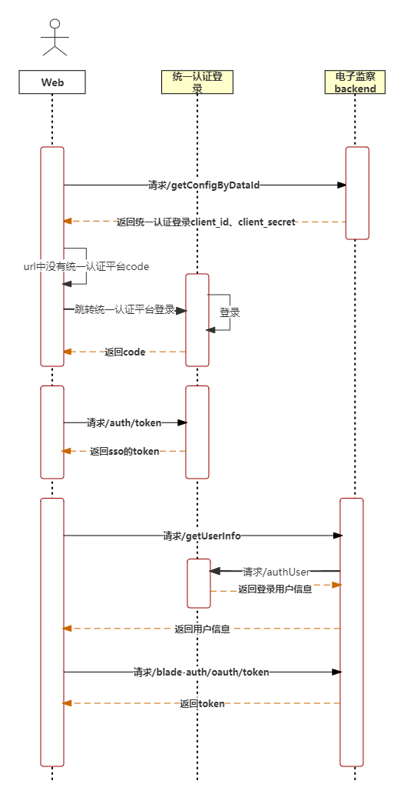
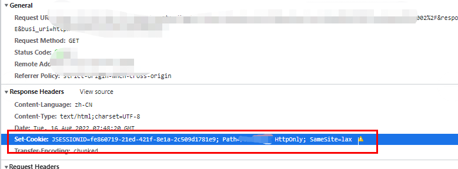

## 需求
系统A网站需求接入系统B网站内容
## 思路
第一想法就是用**iframe**，直接引入系统B地址，将统一认证登陆的token传给系统B进行登陆

**遇到问题**：系统B不愿意支撑，传入token就不要想了。

告知架构师行不通，无奈架构师发现系统B本身就是单点登陆的，系统A通过统一认证登陆后，理论上系统B不需要再登陆。

研究了下系统B单点登陆过程


**又遇到问题**：系统B单点登陆时，会跳转到统一认证网站，iframe嵌入系统后，由于**跨域**的原因，cookie无法写入，导致统一认证网站无法获取登陆状态，也无法登陆



告知架构师后，架构让能不能想办法JQuery直接替换html方式引入 o_o

研究了下web嵌入外部网站通用方法：

##### 1.innerHtml v-html

```javascript
试用了v-html，问题很多，新引入的系统B有自己一套vue代码，有冲突
<script type="text/javascript">
    function getInnerHTML() {
      document.getElementById("container").innerHTML = '<object type="text/html" data="http://10.101.12.254:3030/src/3D-demo/3Dtag.html" width="300" height="500"></object>'
    }
    getInnerHTML()
  </script>

<div id="html" v-html="html"></div>

this.html = ''
```
##### 2.jquery
vue的系统，我疯了用这个
```javascript
<body>
    <div id="container"></div>
    <script>
          $("#container").load(".html");
    </script>
</body>

```
##### 3.iframe
```javascript
<body>
   <div id="container">
        <iframe align="center" width="100%" height="200" src="/xxx.html"  frameborder="no" border="0" marginwidth="0" marginheight="0" scrolling="no"></iframe>
   </div>
 </body>

```
##### 4.import
试用了下，google还没支持该功能page2.import undefined
```html
<head>
    <meta charset="utf-8" />
    <title>主页面</title>
    <!--import引入-->
    <link rel="import" href="top.html" id="page1"/>
    <link rel="import" href="fotter.html" id="page2"/>
</head>
<!--注意顺序-->
<script type="text/javascript">
    document.write(page1.import.body.innerHTML);
</script>
<script type="text/javascript">
    document.write(page2.import.body.innerHTML);
</script>
```

##### 5.其他
```html
试用了下，类似iframe
<object data="xxx.html" width="400" height="300" type="text/html">
    Alternative Content
</object>

<embed src="xxx.html" width="200" height="200" />
```

综合考虑下，还是使用iframe
研究iframe解决跨域问题
搜了半天就没找到能行得通的，修改google设置不可行，修改两个系统网站域名到一个顶级域名下也不行，postMessage也用不了


研究统一认证登录接口文档，发现系统A登录后能够获取到统一认证登录的token，将该token传给系统B，系统B就不用再跳转统一认证登录网站。所以需要修改系统B代码，对方不配合的情况下，就只能将系统B网站拷贝到本地，将拷贝到网站B部署到网站A下

最小代价拷贝系统B网站内容，只拷贝index.html与app.js，其余文件nginx转发到原系统B网址


#### nginx 规则

##### location 

location匹配的是 `$url`, 即`http://localhost/example?a=1`，这里的 `$uri` 就是 /example
= 精确匹配
~ 正则匹配不分大小写
~* 正则匹配区分大小写
^~ 表示url以某个常规字符串开头，理解为匹配url路径即可，nginx不对url做编码，因此请求为/static/20%/aa,可以被规则 ^$ /static/ /aa 匹配到
/   通用匹配，任何请求都会匹配到


##### index
请求的路径中找不到对应的文件就会根据index配置的文件名依次来查找这个路径下是否有这个文件，有就直接返回
例如，根据上图的index的配置，如果请求的路径：http：//www.test.com/a/b 如果这个路径下没有b这个文件，就会走index 继续查找 http://www.test.com/a/b/index.html 有就会返回，没有就返回404

##### try_files
```nginx
location / {
    try_files $uri $uri/ /index.php?_url=$uri&$args;
}
```

我们拿上面这个配置来分析一下，当用户请求 http://localhost/example 时，这里的 `$uri` 就是 /example。
try_files 会到硬盘里尝试找这个文件。如果存在名为 $root/example（其中 $root 是项目代码安装目录）的文件，就直接把这个文件的内容发送给用户。
如果目录中没有叫 example 的文件。然后就看 $uri/，增加了一个 /，也就是看有没有名为 /$root/example/ 的目录。 如果也找不到，会对最后一个参数进行一个内部重定向。且只有最后一个参数可以引起一个内部重定向（最后一个参数是请求URI且必须存在，否则将会出现内部500错误），try_files 的最后一个选项 /index.php，发起一个内部 “子请求”，也就是相当于 nginx 发起一个 HTTP 请求到 http://localhost/index.php

**遇到问题：**
请求/wel/index时, nginx总是会返回301，然后重定向到/wel/index/
为什么会返回**301**呢
301是永久重定向。如果使用Nginx作为HTTP服务器，那么当用户输入一个不存在的地址之后，基本上会有两种情况：1.返回404状态码，2.返回301状态码和重定向地址。

首先需要明确的问题是，301重定向在什么情况下会被触发呢？

答案是：**Nginx负责设置301 Moved Permanently状态码。但nginx.conf控制Nginx如何处理301 Moved Permanently状态码！ 换句话说，要不要进行页面重定向，和怎么重定向，完全是用户配置的结果！** Nginx主动设置301 Moved Permanently状态码只有一种情况，当用户在浏览器输入了一个url地址，末尾部分是一个文件目录且不以斜杠”/“结尾，比如 “[www.test.com/index”](() 。 Nginx没有找到index这个文件，但发现了index是个目录。于是本次访问的返回状态码就会被设置成301 Moved Permanently

/wel/index 应该是返回一个index.html内容，本地文件路径是root/wel/index/index.html
所以这个地方使用了try_files，同时文件路径移动到root/wel/index.html
通过try_files第三个参数，重新请求到/wel/index.html


## 参考
[web端嵌入界面的常用方法](https://juejin.cn/post/6844904032138428430)
[在HTML5中有什么可以替代iFrame](https://blog.csdn.net/weixin_40516924/article/details/104205261)
[H5的template标签和草案中的rel="import"](https://blog.csdn.net/cceking/article/details/81292924)
[nginx 详解](https://blog.csdn.net/lx11573/article/details/118417969)
[聊聊nginx的index/try_files/location指令的使用](https://www.jianshu.com/p/1ab6bb05b0ca)
[Nginx 301跳转踩坑总结](https://blog.csdn.net/didi558/article/details/124297961)